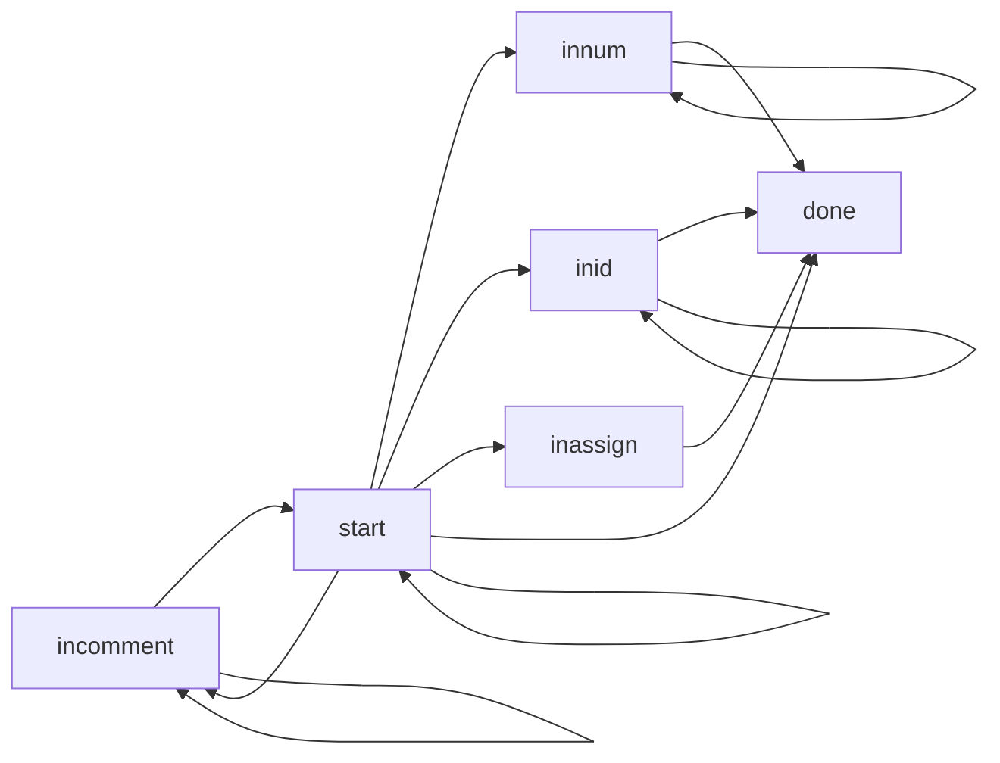
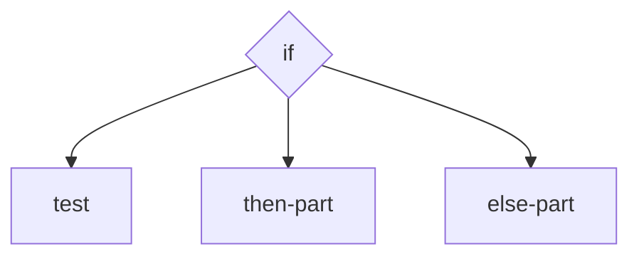
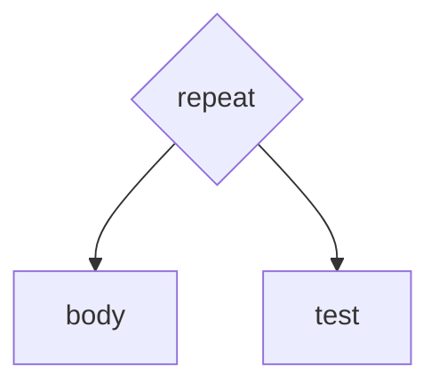
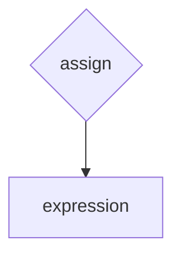
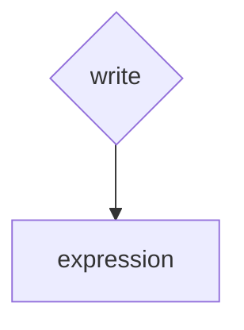

# 《编译原理》课程实验报告
###### 2018302180148袁寰宇，	2018 302180149马陈军


## 1.文法描述
Tiny文法
```
program → stmt-sequence
stmt-sequence → stmt-sequence; statement | statement
statement → if-stmt | repeat-stmt | assign-stmt | read-stmt | write-stmt
if-stmt → if (exp) then stmt-sequence end | if (exp) then stmt-sequence else stmt-sequence end
repeat-stmt → repeat stmt-sequence until exp
assign-stmt → identifier := exp
read-stmt → read identifier
write-stmt → write exp
exp → simple-exp comparson-op simple-exp | simple-exp
comparison → < | =
simple-exp → simple-exp addop term | term
addop → + | -
term → term mulop factor | factor
mulop → * | /
factor → (exp) | number | identifier
number → [1-9][0-9]* | 0
identifier → [a-zA-Z]?
```
Tiny+文法
```
program → declaration-list; stmt-sequence
declaration-list → declaration-list declaration | declaration
declaration → type-specifier identifier;
type-specifier → int | char
stmt-sequence → stmt-sequence; statement | statement
statement → if-stmt | repeat-stmt | assign-stmt | read-stmt | write-stmt
if-stmt → if (exp) then stmt-sequence end | if (exp) then stmt-sequence else stmt-sequence end
repeat-stmt → repeat stmt-sequence until exp
assign-stmt → identifier := exp
read-stmt → read identifier
write-stmt → write exp
exp → simple-exp comparson-op simple-exp | simple-exp
comparison → < | =
simple-exp → simple-exp addop term | term
addop → + | -
term → term mulop factor | factor
mulop → * | /
factor → (exp) | number | identifier
number → (+|-)?([1-9][0-9]* | 0)
identifier → [a-zA-Z]([0-9]| [a-zA-Z])*
```

## 2.程序框架

### 2.1 整体框架
#### 2.1.1 Tiny程序流程
```flow
A=>operation: Tiny源代码
B=>subroutine: 词法分析
C=>subroutine: 语法分析
D=>subroutine: 语义分析
E=>subroutine: 代码生成
F=>operation: Tiny目标程序
A(right)->B(right)->C(right)->D(right)->E(right)->F
```
#### 2.1.2 Tm程序流程
```flow
A=>operation: Tiny目标代码
B=>subroutine: 解释执行程序
C=>operation: 代码运行结果
A(right)->B(right)->C(right)
```
### 2.2 词法分析
编译器执行的第一步就是词法分析程序，该程序的功能是当语法分析程序发出一个getToken()调用时，该程序返回一个token值，同时如果token为NUM或ID时，在tokenString中装入NUM的值或ID的名字。Token有五个基本类型：保留字、特殊符号、数、标识符和其它符号。具体见下表
保留字 | 特殊符号 | 数 | 标识符 | 其他符号
:-: | :-: | :-: | :-: | :-:
if | + | num | id | EOF| 
then | - | num | id | error|
else | * | num | id | error|
end | / | num | id | error|
repeat | = | num | id | error|
until | < | num | id | error|
read | ( | num | id | error|
write | := | num | id | error|
int | ; | num | id | error|
bool |  | num | id | error|
char |  | num | id |error|


开始状态(start)：首先要读进一个字符(调用函数getNextChar)。如读入一个空白字符,则跳过它,继续读字符,直到读入一个非空字符为止。接下去根据所读进的非空字符跳转至相应的程序进行处理。

标识符状态(inid)：识别并组合成标识符以后,调用保留字查表函数reservedlookup,用以确定是保留字还是用户自定义的标识符。按情况输出相应单词:如是标识符则输出单词ID,并将标识符的名字保存在tokenString中,如是保留字则输出相应的单词标志码。 

整数状态(innum)：识别并组合数字，输出单词NUM并将数值结果保存在tokenString中。 

单分界符状态(done)：只需输出其内部的单词标志码。 

双分界符状态(inassign)：如果读入的下一个字符不是”=”则报错,输出单词ERROR。否则,成功识别,输出单词ASSIGN。 

注释状态(incomment)：略过注释内容，直到遇到注释结束标志或者是文件结束标志EOF,并不生成单词。 

错误状态：表示词法分析程序从源程序读入了一个不合法的字符,打印错误信息,输出单词ERROR,略过产生错误的字符，转开始状态继续识别和组合下一个单词符号。 

Tiny+程序词法分析的DFA描述：


### 2.3 语法分析
语法分析为TINY+编译程序的重要部分，语法分析的主要任务是：从源程序符号串中识别出各类语法成份，进行语法检查，最后生成符号表和语法树。 TINY+编译系统采用了递归子程序方法进行语法分析。TINY+语法分析的输入是TOKEN码和tokenString语义信息串。输出结果为语法树，符号表。 TINY+语法分析的主要步骤是：先分析变量声明语句生成符号表，然后再分析语句序列，在分析语句序列时每遇到token为ID时查找符号表，按其变量类型正确调用分析函数。最终生成整个程序的语法树。       

Tiny+ 语法树节点结构定义 
```c
//globals.h
typedef struct treeNode
   { struct treeNode * child[MAXCHILDREN];  //子语法树节点
     struct treeNode * sibling;             //兄弟语法树节点
     int lineno;                            //源程序行号
     NodeKind nodekind; //语法树节点类型
     union { StmtKind stmt; ExpKind exp;} kind;//语句，表达式
     union { TokenType op;
             int val;
             char * name; } attr;//操作符，数值，标识符名称
     ExpType type; //记录语法树的检查类型
   } TreeNode;
```

if语句：最多有三个子节点，child[0]节点为逻辑表达式节点，测试条件是否成立，child[1]节点为条件满足时的语句序列，child[2]节点根据是否有ELSE语句决定存在于否，为条件不满足时的语句序列
```c
TreeNode * if_stmt(void)
{ TreeNode * t = newStmtNode(IfK);
  match(IF);
  if (t!=NULL) t->child[0] = exp();
  match(THEN);
  if (t!=NULL) t->child[1] = stmt_sequence();
  if (token==ELSE) {
    match(ELSE);
    if (t!=NULL) t->child[2] = stmt_sequence();
  }
  match(END);
  return t;
}
```


repeat语句：有两个子节点，child[0]节点为循环体语句序列，child[1]节点是逻辑表达式节点。  
```c
TreeNode * repeat_stmt(void)
{ TreeNode * t = newStmtNode(RepeatK);
  match(REPEAT);
  if (t!=NULL) t->child[0] = stmt_sequence();
  match(UNTIL);
  if (t!=NULL) t->child[1] = exp();
  return t;
}
```


assign语句：有一个子节点，child[0]为表示其值是被赋予的表达式（被赋予的变量名保存在语句节点中）
```c
TreeNode * assign_stmt(void)
{ TreeNode * t = newStmtNode(AssignK);
  if ((t!=NULL) && (token==ID))
    t->attr.name = copyString(tokenString);
  match(ID);
  match(ASSIGN);
  if (t!=NULL) t->child[0] = exp();
  return t;
}
```

write语句：有一个子节点，child[0]表示要写出值的表达式：
```c
TreeNode * write_stmt(void)
{ TreeNode * t = newStmtNode(WriteK);
  match(WRITE);
  if (t!=NULL) t->child[0] = exp();
  return t;
}
```

### 2.4 语义分析
TINY+静态检查各类语义错误。TINY+语义类型检查是通过后序遍历完成，通过对语法树的后序遍历，对于所有非叶节点，其所有子节点的类型已经计算完成，这样可根据其子节点类型及当前操作符判别当前节点类型，将其插入到树节点，并把任意的类型检查错误记录到列表文件中。

#### 2.4.1 对于表达式节点的检查
表达式节点的类型检查有两个任务。首先，它必须确定该表达式子节点是否出现了类型错误，其次，它必须为当前节点推断一个类型并且保存在树节点中的type字段。在TINY+表达式只有两种类型，整型和布尔型。 
#### 2.4.2 对于语句节点的检查
对于语句节点的类型检查主要看其子节点是否满足类型要求。对于Read语句，这里被读出的变量必须自动成为Int类型，因此没有必要进行类型检查。其他语句种类需要一些形式的类型检查If和Repeat语句需要检查它们的测试表达式，确保它们是类型Boolean，而Write、Assign和Return语句需要检查确定被写入、赋值或返回的表达式是整型的。  

```c
//analyze.c，语义分析代码
static void checkNode(TreeNode * t)
{ switch (t->nodekind)
    //对于表达式节点的检查
  { case ExpK:
      switch (t->kind.exp)
      { case OpK:
          if ((t->child[0]->type != Integer) ||
              (t->child[1]->type != Integer))
            typeError(t,"Op applied to non-integer");
          if ((t->attr.op == EQ) || (t->attr.op == LT))
            t->type = Boolean;
          else
            t->type = Integer;
          break;
        case ConstK:
        case IdK:
          t->type = Integer;
          break;
        default:
          break;
      }
      break;
    //对于语句节点的检查
    case StmtK:
      switch (t->kind.stmt)
      { case IfK:
          if (t->child[0]->type == Integer)
            typeError(t->child[0],"if test is not Boolean");
          break;
        case AssignK:
          if (t->child[0]->type != Integer)
            typeError(t->child[0],"assignment of non-integer value");
          break;
        case WriteK:
          if (t->child[0]->type != Integer)
            typeError(t->child[0],"write of non-integer value");
          break;
        case RepeatK:
          if (t->child[1]->type == Integer)
            typeError(t->child[1],"repeat test is not Boolean");
          break;
        default:
          break;
      }
      break;
    default:
      break;

  }
}
```

### 2.5 代码生成
TINY语言的代码生成的目标代码可直接用于易于模拟的简单机器。这个机器称为TM(Tiny Machine)。TM由只读指令存储区、数据区和8个通用寄存器构成。它们都使用非负整数地址且以0开始。寄存器7为程序记数器，它也是唯一的专用寄存器。

TM的指令集以及每条指令效果的简短描述。基本指令格式有两种：寄存器，即RO指令。寄存器-存储器，即RM指令。寄存器指令有如下格式：
```text
RO 指令
格式 opcode r,s,t
操作码  效果
HALT    停止执行(忽略操作数)
IN      reg[r] ← 从标准读入整形值(s和t忽略)
OUT     reg[r] → 标准输出(s和t忽略)
ADD     reg[r] = reg[s] + reg[t]
SUB     reg[r] = reg[s] - reg[t]
MUL     reg[r] = reg[s] * reg[t]
DIV     reg[r] = reg[s] / reg[t] (可能产生ZERO_DIV)

RM 指令
格式 opcode r,d(s)
(a=d+reg[s]; 任何对dmem [a]的引用在a <0或a≥DADDR-SIZE时产生DMEM-ERR)
操作码  效果
LD      reg[r] = dMem[a] (将a中的值装入r)
LDA     reg[r] = a (将地址a直接装入r)
LDC     reg[r] = d (将常数d直接装入r, 忽略s)
STd     Mem[a] = reg[r] (将r的值存入位置a)
JLT     if (reg[r]<0) reg[PC_REG] = a (如果r小于零转移到a，以下类似)
JLE     if (reg[r]<=0 reg[PC_REG] = a
JGE     if (reg[r]>0) reg[PC_REG] = a
JGT     if (reg[r]>0) reg[PC_REG] = a
TEQ     if (reg[r]==0) reg[PC_REG] = a
JNE     if (reg[r]!=0) reg[PC_REG] = a
```
Tiny+语言在code.c 中定义了7个代码发行函数
```c
//emitComment函数会以注释格式将其参数串打印到代码文件中的新行中。
void emitComment( char * c )
{ if (TraceCode) fprintf(code,"* %s\n",c);}

//emitRO、emitRM为标准的代码发行函数
//该函数除指令串和3个操作数外
//每个函数还带有1个附加串参数，它被加到指令中作为注释。
void emitRO( char *op, int r, int s, int t, char *c)
{ fprintf(code,"%3d:  %5s  %d,%d,%d ",emitLoc++,op,r,s,t);
  if (TraceCode) fprintf(code,"\t%s",c) ;
  fprintf(code,"\n") ;
  if (highEmitLoc < emitLoc) highEmitLoc = emitLoc ;
} /* emitRO */

void emitRM( char * op, int r, int d, int s, char *c)
{ fprintf(code,"%3d:  %5s  %d,%d(%d) ",emitLoc++,op,r,d,s);
  if (TraceCode) fprintf(code,"\t%s",c) ;
  fprintf(code,"\n") ;
  if (highEmitLoc < emitLoc)  highEmitLoc = emitLoc ;
} /* emitRM */

//emitSkip函数用于跳过将来要反填的n条指令并返回当前指令位置行号。
int emitSkip( int howMany)
{  int i = emitLoc;
   emitLoc += howMany ;
   if (highEmitLoc < emitLoc)  highEmitLoc = emitLoc ;
   return i;
} /* emitSkip */

//用于设置当前指令位置到先前由emitSkip函数返回并保存起来的位置
void emitBackup( int loc)
{ if (loc > highEmitLoc) emitComment("BUG in emitBackup");
  emitLoc = loc ;
} /* emitBackup */

//用于返回当前指令位置到指令集的顶点,即调用emitBackup前的指令位置。
void emitRestore(void)
{ emitLoc = highEmitLoc;}

//emitRM_Abs用于在先前由emitSkip保存位置处产生一条件转移指令或无条件跳转指令。
void emitRM_Abs( char *op, int r, int a, char * c)
{ fprintf(code,"%3d:  %5s  %d,%d(%d) ",
               emitLoc,op,r,a-(emitLoc+1),pc);
  ++emitLoc ;
  if (TraceCode) fprintf(code,"\t%s",c) ;
  fprintf(code,"\n") ;
  if (highEmitLoc < emitLoc) highEmitLoc = emitLoc ;
} /* emitRM_Abs */

```
TINY+代码生成器在文件cgen.c中，其中提供给TINY编译器的唯一接口是codeGen，该函数本身所做的事极少，产生一些注释和标准序言指令、设置启动时运行环境，然后在语法树上调用cGen，最后产生HALT指令终止程序。标准序言由两条指令组成：即跳过全局变量，将fp,sp定义为主活动记录起始点。
## 3.测试案例与测试结果


## 4.提交内容说明

### 4.1源程序运行环境说明
#### 4.1.1 Linux环境
系统版本：Ubuntu 18.04
编译器版本：gcc 7.5.0
在Linux系统下使用命令行进入工程目录，直接使用make命令即可进行编译
```bash
> make all
gcc  -c main.c
gcc  -c util.c
gcc  -c scan.c
gcc  -c parse.c
gcc  -c symtab.c
gcc  -c analyze.c
gcc  -c code.c
gcc  -c cgen.c
gcc  main.o util.o scan.o parse.o symtab.o analyze.o code.o cgen.o -o tiny
gcc  -o tm tm.c
```
#### 4.1.2 Windows环境
系统版本：Windows 10
编译器版本：gcc 6.3.0
在Windows中，需要安装mingw来配置C/C++编译环境，安装好mingw并将其添加到系统环境变量中，即可使用。打开cmd，进入工程目录，使用mingw32-make命令即可进行编译。
```bash
> mingw32-make all
gcc  -c main.c
gcc  -c util.c
gcc  -c scan.c
gcc  -c parse.c
gcc  -c symtab.c
gcc  -c analyze.c
gcc  -c code.c
gcc  -c cgen.c
gcc  main.o util.o scan.o parse.o symtab.o analyze.o code.o cgen.o -o tiny.exe
gcc  -o tm.exe tm.c
```
### 4.2程序运行操作说明
#### 4.2.1 tiny编译器
假定已经编译好tiny编译器的可执行文件是tiny，通过使用以下命令：
```bash
>tiny sample.tny
```
就可用它编译文本文件sample.tny中的TINY源程序，生成目标代码文件sample.tm（在下面的TM机中使用）
main.c 有以下选项可供使用：
标志 |设置效果
:-: | :-:
EchoSource|将TINY源程序回显到带有行号的列表
TraceScan|当扫描程序识别出记号时，就显示每个记号的信息
TraceParse|将语法树以线性化格式显示
TraceAnalyze|显示符号表和类型检查的小结信息
TraceCode|打印有关代码文件的代码生成跟踪注释
#### 4.2.2 tm机
假定已经编译好的tm机可执行文件叫作tm，通过发出命令：
```bash
>tm sample.tm
```
就可使用它了。其中，sample.tm是TIMY编译器由sample.tny源文件生成的代码文件。该命令引起代码文件的汇编和装入，接着就可交互地运行TM模拟程序了。
tm机的指令如下,括号内容表示可选参数：
标志 |设置效果
:- | :-
s (n)      |执行n条（默认为1）tm指令
g          |执行tm指令直到停止
r          |打印寄存器内容
i (b (n))  |从b开始打印n个iMem位置
d (b (n))  |从b开始打印n个dMem位置
t          |切换指令跟踪
p          |切换执行的总指令的打印
c          |重置模拟，重新开始模拟
h          |打印帮助列表
q          |终止tm机
## 5.实验小结
通过编写此编译器程序，达到了充实知识，锻炼能力的目的，是一次不可多得的锻炼学习的机会。同时，通过对编译原理的更深一步学习，体会到了这门课程所蕴含着的计算机科学中解决问题的思路和抽象问题的解决方法，这些将对我们今后的学习工作给予很大启发和帮助。