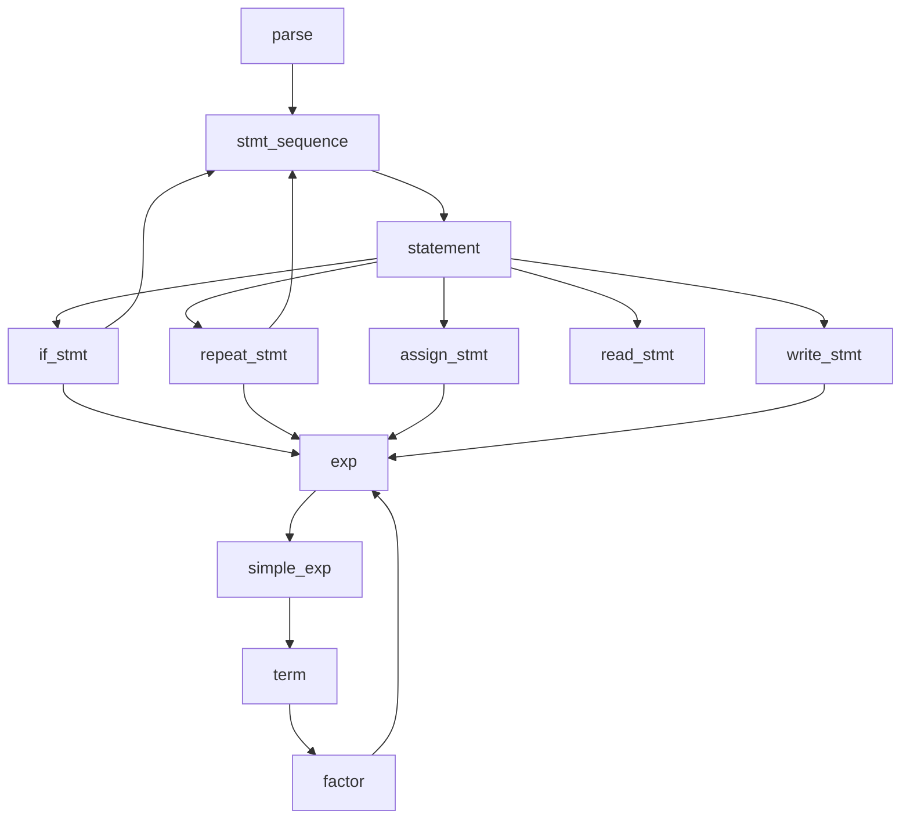
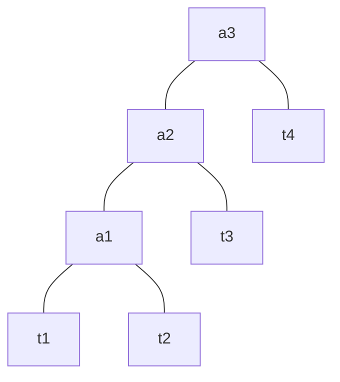

# 对代码的理解

## 原来的代码

### GLOBALS.H

#### MAXRESERVED
保留字的个数。保留字包括：if, then, else, end, repeat, until, read, write  
存储在scan.c中的一个名为reservedWords的数组中，数组的长度即为MAXRESERVED

#### TokenType
枚举类型，意思是标记(token)的类型。包括：  
book-keeping(?)：ENDFILE,ERROR  
保留字：IF,THEN,ELSE,END,REPEAT,UNTIL,READ,WRITE  
多字符token：ID(变量名), NUM(数)  
特殊符号：ASSIGN(赋值), EQ(等号), LT(小于), PLUS(加), MINUS(减), TIMES(乘), OVER(除), LPAREN(左括号), RPAREN(右括号), SEMI(分号)

#### TreeNode
语法树结点类型，是一个结构体  
child数组：长度为三，表示一个结点最多有三个子结点  
sibling：指向兄弟结点  
lineno：行号  
nodekind：结点类型，分为StmtK(statement, 语句)和ExpK(expression, 表达式)
其中，StmtK又可以细分为If, Repeat, Assign, Read, Write  
ExpK又可以细分为Op(运算符号), Const(常量), Id(变量标识符)  
attr：猜测是表达式中结点的属性，其中：  
|结点类型|属性类型|
|-|-|
|Op(运算符号)|TokenType op|
|Const(常量)|int val|
|Id(变量名)|char *name|
type：应该是expression的数据类型，包括void, int, bool  

### UTIL.H

#### printToken
根据标记(token)类型打印词素，具体来说：  
保留字，如if, then, else, end, repeat等等，直接打印出if, then, else, end等等  
特殊符号，如:=, =, +, -, *, /等等，打印出对应的符号  
常数与变量，打印token类型以及具体内容  
ERROR，打印ERROR类型以及ERROR的内容  

#### newStmtNode
创建statement类型的结点，传入的参数指明statement的具体类型：If, Repeat, Assign, Read, Write  
返回指向新的树结点的指针

#### newExpNode
创建expression类型的结点，传入的参数指明expression的具体类型：Op(运算符号), Const(常量), Id(变量标识符)  
返回指向新的树结点的指针

#### copyString
新分配一段内存，将已有字符串复制一份放入新分配内存中，返回新分配内存的指针

#### printTree
打印语法树，用缩进来指明子树  
测试这一函数需要在main.c中将TraceParse置为TRUE，以下是对sample.tny打印的语法树  
```
  Read: x
  If
    Op: <
      Const: 0
      Id: x
    Assign to: fact
      Const: 1
    Repeat
      Assign to: fact
        Op: *
          Id: fact
          Id: x
      Assign to: x
        Op: -
          Id: x
          Const: 1
      Op: =
        Id: x
        Const: 0
    Write
      Id: fact
```
大胆猜测：缩进代表的是它处在语法树的哪一层，缩进相同且上下紧挨在一起的是兄弟结点，它们的双亲结点为：往上走遇到的第一个缩进比它们小的结点。

### SCAN.H SCAN.C

#### StateType
表示DFA中状态的一个数据类型，包括：  
|名字|释义|
|-|-|
|START|开始|
|INASSIGN|在赋值语句中|
|INCOMMENT|在注释中|
|INNUM|在数当中|
|INID|在变量标识符当中|
|DONE|结束|

#### tokenString
一个字符串，存储一个token的词素，如变量标识符具体的变量名，保留字具体的那个字符串(如"if", "then"等等)

#### getNextChar
从当前行中取下一个字符，并返回这个字符。  
具体实现原理是先读取一行，将其放进一个数组中，再从这个数组中返回字符  
如果fgets读取失败，就会返回EOF

#### ungetNextChar
回退一个字符，具体操作就是指向字符的指针减一

#### reservedWords
一个储存保留字的数组，表现了字符串和保留字类型的对应关系

#### reservedLookup
判断一个字符串是保留字还是变量标识符。如果是保留字，返回保留字对应的TokenType，如果是变量标识符则返回ID

#### getToken
SCAN.C定义的函数当中，唯一一个可以被别的文件调用的函数  
具体功能：依次返回源代码中token的类型  
具体算法：  
首先将state置为START，然后便会进入switch语句中的case START部分  
在这一部分中，首先便会判断c(首字符)的类型，根据c的类型选择相应的操作  
|c的类型|操作|
|-|-|
|c是数字(isdigit)|state = INNUM;  进入一个数|
|c是字母(isalpha)|state = INID;  进入一个变量标识符|
|c是冒号(:)|state = INASSIGN; 进入一个赋值符号|
|c是分隔符(空格, \t, \n)|save = FALSE;  不要将这个字符存入tokenString|
|c是左大括号({)|state = INCOMMENT;  进入一段注释<br>save = FALSE;  不要将这个字符存入tokenString|
|c是其他字符|state = DONE;  这直接就是最后一次循环了。然后根据c的具体内容给currentToken赋值，最后函数会返回currentToken的值|

在一次循环的switch结束后，还会进行以下两个操作：  
1.根据save的取值决定是否将字符存入tokenString(存储词素的字符串)  
2.如果state == DONE，则在tokenString末尾加上'\0'，并且再判断一下tokenString究竟是变量标识符还是保留字，根据这个修改一下currentToken。这个时候其实已经到了最后一次循环了，可以等着返回了

第一次循环后state已经不再是START，而是根据第一个字符的类型已经有了不同的值，第二次及之后的state的值与对应的操作如下表：
|state的值|操作|
|-|-|
|INCOMMENT|读取到的字符不会被存入tokenString<br>如果读到文件末尾，则currentToken为ENDFILE，循环结束了<br>如果遇到右大括号，说明注释读完了，于是将state置为START，继续下一个循环|
|INASSIGN|说明之前读到的第一个是冒号，所以接下来必须读到等号<br>如果读到的是等号，则循环结束，函数返回ASSIGN，否则返回ERROR|
|INNUM|说明现在正在读一个数，如果读到一个非数字，说明这个数读完了，退出循环，函数返回NUM<br>这个时候数的内容保存在tokenString当中|
|INID|说明正在读一个变量名，如果读到一个非字母，说明这个变量名读完了，退出循环，函数返回ID<br>从这段代码可以看出，原来TINY的变量名只能包含字母，但TINY+变量名是可以包含数字的，因此是一个修改的点|

通过将TraceScan置为TRUE，可以打印token的类型与词素。打印SAMPLE.TNY的scan结果可以得到以下内容：
```
        5: reserved word: read
        5: ID, name= x        
        5: ;
        6: reserved word: if  
        6: NUM, val= 0        
        6: <
        6: ID, name= x        
        6: reserved word: then
        7: ID, name= fact
        7: :=
        7: NUM, val= 1
        7: ;
        8: reserved word: repeat
        9: ID, name= fact
        9: :=
        9: ID, name= fact
        9: *
        9: ID, name= x
        9: ;
        10: ID, name= x
        10: :=
        10: ID, name= x
        10: -
        10: NUM, val= 1
        11: reserved word: until
        11: ID, name= x
        11: =
        11: NUM, val= 0
        11: ;
        12: reserved word: write
        12: ID, name= fact
        13: reserved word: end
        14: EOF
```

### PARSE.H PARSE.C

#### syntaxError
说明遇到语法错误，打印行号和错误信息，把初值为FALSE的Error变量置为TRUE

#### match
传入的参数为预期的token，将token与预期的token对比，如果不匹配就会报错。同时，如果匹配的话，match会自动让token的值变成下一个token。

#### 一些函数的调用关系
PARSE.H中能被其他文件调用的应该只有parse函数，但parse函数又调用了其他在PARSE.C中定义的函数，而调用的函数又调用了其他函数。这个多层调用可用下图表示：

这些代码应该是对着TINY语言的文法写的。于是找到TINY的上下文无关文法：
```
program		->  stmt-sequence
stmt-sequence	->  stmt-sequence ; statement | statement
statement	->  if-stmt | repeat-stmt | assign-stmt | read-stmt | write-stmt
if-stmt	->  if exp then stmt-sequence end | if exp then stmt-sequence else stmt-sequence end
repeat-stmt	->  repeat stmt-sequence until exp
assign-stmt	->  identifier:=exp
read-stmt	->  read identifier
write-stmt	->  write exp
exp	->  simple-exp comparison-op simple-exp | simple-exp
comparison-op ->  < | =
simple-exp  ->  simple-exp addop term | term
addop	->  + | -
term	->  term mulop factor | factor
mulop	->  * | /
factor	->  (exp) | number | identifier

```
对比后发现，确实这些调用关系可以和TINY的上下文无关文法对应起来。这种将非终结符写成函数的做法很像递归下降分析法。

#### parse
parse对应文法中的非终结符program，首先读取一个token，然后调用stmt_sequence，这个举动对应产生式program -> stmt-sequence

#### stmt_sequence
这个函数对应的产生式为：stmt-sequence -> statement ; statement | statement  
这个函数的代码中while循环的条件有些难以理解，所以试试求stmt-sequence的FIRST和FOLLOW集  
FIRST集：IF, REPEAT, ID, READ, WRITE  
FOLLOW集：ENDFILE, END, ELSE, UNTIL, SEMI  
进一步发现，statement的FIRST和FOLLOW集和它一样

这是一个左递归，最终总可以变成statement {; statement}的形式  
在接受了一个statement检测后，要看跟在statement后面的是什么。  
如果是ENDFILE, END, ELSE, UNTIL，说明这个stmt-sequence已经结束了，于是就返回了。  
如果这个statement后面跟着的是分号，那么说明还在stmt-sequence里面，于是继续分析后面的statement，把后面的statement作为前面statement结点的sibling。最终同一个stmt-sequence中的statement会通过sibling的连接构成一串。

#### statement
这个函数对应的产生式为：statement -> if-stmt | repeat-stmt | assign-stmt | read-stmt | write-stmt  
这个产生式每一个选项开头的token都不一样，且只有可能为IF, REPEAT, ID, READ, WRITE，所以根据不同的token进入不同的分支  
最终事成之后，返回的是和下一级相同的根节点。具体说来，比如说这是个if语句，if的根节点是IfK类型，那么这个函数返回的根节点也会是IfK类型。

#### if_stmt
这个函数对应的产生式为：if-stmt -> if exp then stmt-sequence end | if exp then stmt-sequence else stmt-sequence end  
这个生成的IfK结点视情况会有2-3个子结点，对应 exp stmt-sequence [stmt-sequence]

#### repeat_stmt
这个函数对应的产生式为：repeat-stmt -> repeat stmt-sequence until exp  
生成的树的结点类型为RepeatK，有两个子结点，对应 stmt-sequence exp

#### assign_stmt
这个函数对应的产生式为：assign-stmt -> identifier:=exp  
这个函数生成的树结点类型为AssignK，attr为被赋值变量identifier，有一个子结点exp

#### read_stmt
这个函数对应的产生式为：read-stmt -> read identifier  
这个函数生成的树结点类型为ReadK，attr为identifier的名字

#### write_stmt
这个函数对应的产生式为：write-stmt -> write exp  
这个函数生成的树结点类型为WriteK，有一个子结点，对应exp

#### exp
这个函数对应的产生式为：exp -> simple-exp comparison-op simple-exp | simple-exp  
这个要分情况讨论：  
如果在接收了一个simple-exp之后，下一个token不是LT或EQ，说明这个exp仅仅会被归约成simple-exp，因此，返回的结果直接就是和simple-exp一样  
如果检测到了LT或EQ，那么这个函数返回的树结点类型就是OpK，attr就指明了这个comparison-op的类型，两个子结点就是两个simple-exp

#### simple_exp
这个函数对应的产生式为：simple-exp -> simple-exp addop term | term  
这是一个左递归，最终可以变成term {addop term}的形式  
于是，先检测一个term，然后再是一个while循环，不停地检测addop term，像这样构造树。  
举一个例子说明可能更直观一些。假如有一个simple-exp，形式为：
```
t1 a1 t2 a2 t3 a3 t4
```
其中，t表示term，a表示addop，那么根据这个算法最终得到的树的结构为：


#### term
这个函数对应的产生式为term -> term mulop factor | factor  
也是个左递归，算法原理和上面的simple-exp一样的

#### factor
这个函数对应的产生式为factor -> (exp) | number | identifier  
也是根据读到的第一个Token来分情况讨论  
如果读到的是一个数，那么返回ConstK类型的树结点，结点的attr为读到的数的取值  
如果读到的是一个ID，那么返回IdK类型的树结点，结点的attr为变量的名称  
如果读到的是一个左括号，说明是(exp)的形式，于是返回的结点为exp函数生成的树的根结点